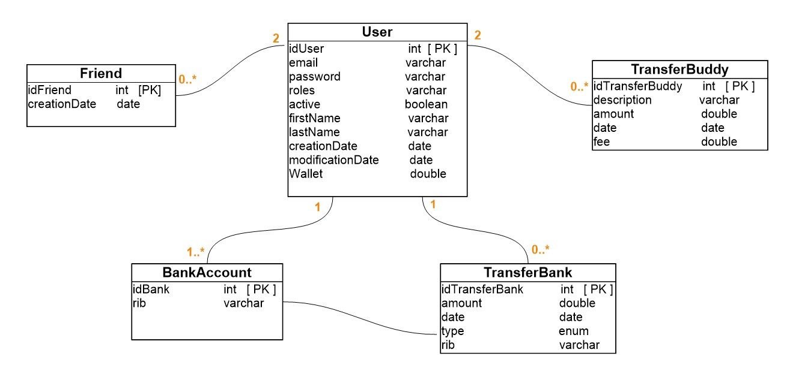

PayMyBuddy  V1.0
========================

Description
------------
Pay My Buddy is an application that allows you to easily transfer money to your friends to facilitate the organization of events

## Prerequisites
### Technologies
- Spring Boot
- Spring MVC
- Spring Data JPA
- Hibernate
- Spring Security
### Installing

Here are the links for the prerequisites necessary for proper operation. In addition.
    
 Install Java:
* https://www.oracle.com/fr/java/technologies/javase-downloads.html

Install Maven:
* https://maven.apache.org/install.html

Install MySql
* https://dev.mysql.com/downloads/mysql

## Running App

After downloading and installing, you'll finally be ready to import the code into an IDE of your choice and run App.java to launch the app.

To run the tests from maven, go to the folder that contains the pom.xml file and execute the below command.
### To initialize the database

Go to the application.properties folder on line 11 (Warning: the folder which is in main ^^). 

Remove the "#" to make this line operational.
This will allow the database to be initialized.

In order to persist the data it will make you enter line 11 again with the "#".

## Modelization
###  Physical data model

###  Class Diagram

